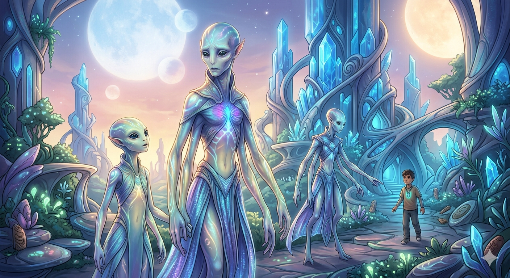

# The Jade Trail

**Studio:** Kaupeka Tech &nbsp;|&nbsp; **Author:** Turei Milner &nbsp;|&nbsp; **Status:** P1/P2 Wireframe — Active Development

> *"What is passed down saves lives."*

A painterly sci-fi adventure game. A father watches an alien race take his 12-year-old son. With nothing but the jade stone his boy dropped — fused with alien technology — he builds his own ship and chases them across the galaxy, following the clues his son leaves behind.

---

## The Story

**David Sunrise** lands one step behind his son on every planet. He has an AI companion, **Kora**, who reads light-signatures — traces of where Matiu has been. He harvests materials from each world, crafts upgrades, and gets closer.

**Matiu Sunrise** is 12 years old and under guard. He can't escape yet — but he can explore, earn the trust of his captors, and hide clues in the places he knows his father will search.

Two players. One world. The same trail — from opposite ends.

| Character | Role | Mode |
|---|---|---|
| **David Sunrise** | Seasoned explorer. Builds his ship stop by stop. | Adult Mode |
| **Matiu Sunrise** | 12-year-old. Earns trust. Leaves clues. | Kid Mode |
| **Marama Sunrise** | Fierce and protective family figure | Story |
| **Kora** | David's AI — reads alien signatures, guides crafting | Adult Mode |
| **Vaelin** | Ethereal alien guide — bridges worlds | Story |

---

## Gameplay

The game runs in two playable modes — designed to be played together (parent + child) or solo.

### Kid Mode — Play as Matiu
Explore each planet under guard. Every zone you unlock, every discovery you make, builds trust. When trust is high enough — hide a clue where your dad will find it.

- Trust meter unlocks new exploration zones
- Discover real science facts embedded in each planet
- Hide the clue in the final unlocked zone to complete the level

### Adult Mode — Play as David
Land on the same planet, a step behind. Kora detects light-signatures Matiu left. Find the clue. Harvest local materials. Craft ship upgrades with what the planet offers.

- Scan zones for Matiu's light-signature
- Harvest planet-specific materials (iron oxide on Mars, CO₂ fuel vents)
- Craft upgrades in the Fabricator — hull plating, fuel refiners, and more
- Recover the clue Matiu hid to complete the level

---

## Planet 1 — Mars

> *"The sky here is orange — like rust. Everything is red."* — Matiu

| Zone | Unlocks at Trust |
|---|---|
| Landing Zone | 0 |
| Crater Rim | 30 |
| Canyon Edge | 60 |

**Discoverable science on Mars:**
- 🪨 Rust Soil — iron oxide (Fe₂O₃) gives Mars its red colour
- ⬆️ Low Gravity — 37.6% of Earth's, 3.72 m/s²
- 🌪️ Dust Storm — global storms can reduce solar power by 99%

**Harvestable materials:**
- ⛏️ Iron Oxide Deposit (Crater Rim) → crafts Hull Plating Mk.1
- 💨 Atmospheric CO₂ Vent (Landing Zone) → crafts CO₂ Fuel Refiner

---

## Visual Style

Semi-realistic with painterly textures and stylised lighting. Nature environments use deep blues and luminous greens. Ancient technology renders in warm golds and deep reds. Every scene is crafted to feel like a living painting — immersive, atmospheric, emotionally resonant.



---

## Architecture

Planets are config, not code — adding a new world means adding a new data file. No changes to the engine.

```
src/
  data/
    planets/mars.js         ← add europa.js here for Planet 2
    clues/marsClue1.js      ← shared clue object, read by both modes
  systems/
    progression.js          ← trust, unlock, harvest, craft logic
  components/
    screens/                ← HomeScreen, KidModeScreen, AdultModeScreen
    kid-mode/               ← TrustMeter, LightBarrier, ExplorationZone, ClueHider
    adult-mode/             ← KoraHUD, ClueFinder, HarvestPanel, FabricatorPanel
    shared/                 ← PlanetHeader, ClueCard
```

---

## Quick Start

```bash
npm install
npm run dev
```

---

## Roadmap

| Phase | Goal | Status |
|---|---|---|
| P1 | Kid Mode — Mars | ✅ Built |
| P2 | Adult Mode — Mars (interlock) | ✅ Built |
| P3 | Opening — Earth (abduction scene) | — |
| P4 | Planet 2 — Europa | — |
| P5 | Unity (C#) migration | — |
| P6+ | Zone 2 worlds, The Turn, endgame | — |

---

## Contact

Open to partnership, feedback, and publishing collaboration.

- 🏢 Kaupeka Tech

---

*Kaupeka Tech · v0.1 Wireframe · June 2026*
